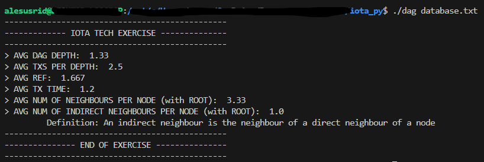

# IOTA Foundation Tech Problem

Solution for the IOTA technical problem by Alejandro Susillo

## Installation

1. You must have python installed depending on your operating system.
2. Make sure you run this command in case you're running the bash file in a Linux environment

```bash
dos2unix dag
```

3. Grant execution permission to files

```bash
chmod +x dag
chmod u+x index.py
```

4. Finally, run the command

```bash
./dag database.txt
```

## Output Image


